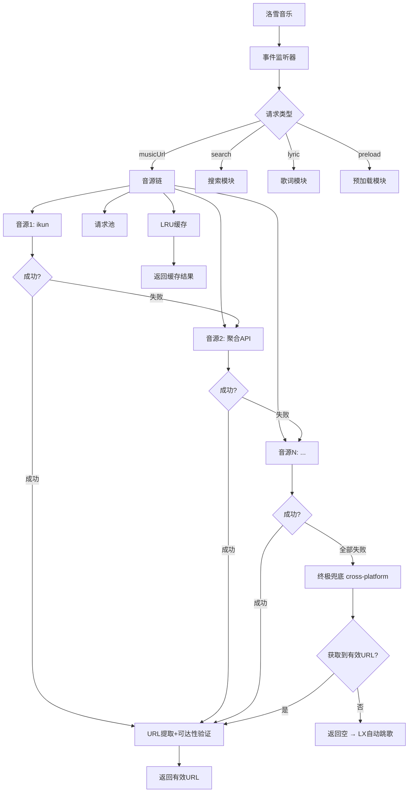

# 🎵 七零喵聚合音源 · 超级整合版


## 📖 项目简介

**七零喵聚合音源** 是为 [洛雪音乐（LX Music）](https://github.com/lyswhut/lx-music-desktop) 设计的超级整合版音源脚本，集成 **20 余种音源 API**，支持 **weapi/eapi **，支持 weapi/ea[...]

> 🎵 让音乐播放不再中断，让搜索更加智能。

---

## ✨ 主要特性

### 🎯 核心功能
- **多音源聚合**：整合 ikun、聚合 API、qorg、星海（GD音乐台）、溯音、六音、独家音源、长青 SVIP、念心 SVIP、野花野草、Meting、汽水 VIP、肥猫系列、梓[...]
- **智能回退**：当一个音源失败时，自动按优先级切换到下一个可用音源，确保播放不中断
- **终极兜底与自动跳歌（v3.7 新增）**：所有常规音源全部失败后，自动调用 `api.qlm.org.cn` 兜底接口，并跨平台（kg→kw→tx→wy 等）尝试获取音频链接；[...]
- **智能缓存**：采用 LRU 缓存机制，减少重复网络请求，显著提升响应速度
- **预加载下一首**：在播放当前歌曲时预加载下一首歌曲，实现无缝切换
- **请求并发控制**：内置请求池，避免大量并发请求导致网络拥堵
- **完善错误处理**：修复以往版本中 303 重定向、ID 缺失等关键问题，增强整体稳定性
- **weapi/eapi 双加密**：网易云音乐接口支持 weapi 加密并自动回退 eapi，提升获取成功率
- **平台专项修复**：qorg 音源（`api.qlm.org.cn`）仅限网易云平台，防止跨平台调用错误；ID 缺失时自动搜索补全；主接口失败时自动回退自建网易云端点；[...]
- **引擎兼容性增强**：针对 Hermes 引擎（React Native）增加 Polyfill，修复 `Object.fromEntries` 与 `Array.prototype.includes` 缺失问题；完善全局对象与事件名称的安[...]
- **智能 URL 提取与验证**：内置 `extractUrl` / `deepExtractUrl` 函数，深度递归提取各音源返回结构中的音频链接；`validateAudioUrl` 预检发送 HEAD 请求验证链接；[...]
- **长青/念心 SVIP 增强**：增加 URL 可达性强制验证，避免返回不可播放的链接
- **Free listen 酷我/酷狗改造**：复用肥猫音源，提升稳定性

### 🎵 音乐平台支持
- **QQ音乐 / 网易云音乐 / 酷我音乐 / 酷狗音乐 / 咪咕音乐**：全平台覆盖
- **网易云盘**：支持网易云音乐云盘歌曲的搜索、播放和歌词获取
- **自建网易云**：集成独立的自建网易云音乐 API，支持搜索、播放、歌单、登录功能
- **汽水 VIP**：支持高音质 VIP 歌曲播放

### 🔧 技术特性
- **多平台适配**：兼容桌面版和移动版洛雪音乐（包括 Hermes 引擎）
- **并发控制**：内置请求池，避免大量并发请求
- **超时与重试**：可配置的请求超时和自动重试机制
- **搜索补全 ID**：qorg 音源在歌曲 ID 缺失时，自动通过搜索接口补全
- **主备回退**：qorg 主接口获取失败时自动切换至自建网易云回退端点
- **终极跨平台兜底**：v3.7 起在全部音源失败后，自动按 kg/kw/tx/wy 顺序尝试兜底接口，最大限度提高播放成功率
- **URL 深度提取与可达性验证**：所有音源均经过强化提取与可选预检，确保最终返回的链接真实可播
- **自动更新**：支持在线导入，每次重启自动检查更新

---

## 🚀 快速开始

### 前置要求

| 要求 | 说明 |
|------|------|
| **洛雪音乐** | 桌面版或移动版均可 |
| **版本要求** | **v1.7.5 及以上** |
| **网络环境** | 需要能够访问 GitHub 及音源服务器 |

### 方式一：在线导入（⭐ 推荐，自动更新）

1. 打开洛雪音乐助手
2. 进入「**设置**」→「**基本设置**」→「**音乐来源**」
3. 选择「**自定义源**」或「**导入源**」
4. 填入以下任一链接：

```bash
# GitHub 原始链接（国内可能需要代理）
https://raw.githubusercontent.com/xcqm12/qlm-music/main/qlm-v9.0.0.js

# 备用链接（CDN，推荐）
https://cdn.jsdelivr.net/gh/xcqm12/qlm-music/qlm-v9.0.0.js
```

💡 提示：使用在线导入方式，每次重启洛雪音乐时会自动检查更新。
若需使用其他修复版本，可替换为对应文件名。

方式二：本地文件导入

1. 从本仓库下载推荐版本文件：
   · ⭐ qlm-v9.0.0.js（最新版本，强烈推荐）
   · …（更多历史版本见文件列表）
2. 在洛雪音乐中选择「本地文件」方式导入
3. 浏览并选择下载的 .js 文件即可

方式三：直接复制脚本内容

1. 打开对应版本的 .js 文件
2. 复制全部代码
3. 在洛雪音乐中选择「粘贴导入」或直接粘贴到自定义源输入框

---

## 📦 版本选择

> **🔥 最新发布版：`qlm-v9.0.0.js`**  
> 旗舰整合版，集成最新优化和增强功能，推荐所有用户升级。

| 版本 | 状态 | 说明 | 推荐场景 |
|-----|-----|-----|------|
| **qlm-v9.0.0** | ⭐ **最新强烈推荐** | 最新旗舰版本，整合最新增强与优化 | 所有用户 |
| v7.1.2-ultimate-merged-v5.2-enhanced | ⭐ 推荐 | 旗舰整合版，整合汽水VIP全功能（搜索+歌词），优化回退链、修复 freelisten/fish ID缺失、念心长[...] | 若不需要最新版本可继续使用 |
| v7.1.2-ultimate-fix-v3.7 | ⭐ 推荐 | 终极修复版 v3.7，新增终极兜底跨平台回退，失败自动跳歌 | 若不需要新版整合特性可继续使用 |
| v7.1.2-ultimate-fix-v3.6 | ✅ 可用 | v3.6 增强 URL 提取与预检，长青/念心强制验证 | 追求稳定但无需兜底 |
| v7.1.2-ultimate-fix-v3.5 | ✅ 可用 | v3.5 增加 Hermes 引擎兼容 Polyfill | 老旧设备或特殊环境 |

<details>
<summary><b>📜 历史版本（部分已弃用）</b></summary>

> ⚠️ **注意**：`v3.8` 至 `v5.1` 版本已标记为弃用，不再推荐使用，可能存在已知问题或缺少最新增强，请优先使用 `v9.0.0` 或 `v7.1.2-ultimate-merged-v5.2-enhanced`。

以下为 `v7.1.2-ultimate-fix` 系列旧版本（按时间倒序）：

| 版本 | 状态 | 说明 |
|-----|-----|------|
| v7.1.2-ultimate-fix-v3.7 | ⭐ 仍可用 | 终极兜底与自动跳歌 |
| v7.1.2-ultimate-fix-v3.6 | ✅ 可用 | URL 深度提取与预检 |
| v7.1.2-ultimate-fix-v3.6-fixed-patch1 | 🔧 已修补 | 长青/念心可达性补丁 |
| v7.1.2-ultimate-fix-v3.5 | ✅ 可用 | Hermes 兼容 |
| v7.1.2-ultimate-fix-v3.4 | ✅ 可用 | qorg 三重回退 |
| v7.1.2-ultimate-fix-v3.3 | ✅ 可用 | qorg Bad Request 修复 |
| v7.1.2-ultimate-fix-v3.2 | ✅ 可用 | qorg 主备回退 |
| v7.1.2-ultimate-fix-v3.1 | ✅ 可用 | weapi/eapi 双加密强化 |
| v7.1.2-ultimate-fix-v3 | ✅ 可用 | qorg ID 修复 |
| v7.1.2-ultimate-fix-v2 | ✅ 可用 | 早期修复版本 |
| … | … | 更早版本见仓库记录 |

**`3.8` ~ `5.1` 为中间开发版本，已停止维护，请勿下载使用。**

</details>

---

🎵 支持的平台

|平台 | 标识 | 支持音质|
|------|------|-----------|
|QQ音乐| tx |128k ~ 24bit|
|网易云音乐 |wy |128k ~ 24bit|
|酷我音乐| kw |128k ~ 24bit|
|酷狗音乐| kg |128k ~ 24bit|
|咪咕音乐| mg |128k ~ 24bit|
|汽水VIP |qishui |128k ~ 24bit|
|qorg音源（仅限网易云）| qorg |128k ~ 24bit|
|网易云盘| wycloud |128k ~ 24bit|
|自建网易云 |wycloudmusic |128k ~ flac|

---

🔌 集成的音源

|优先级 |音源名称| 说明|
|-----|-------|------| 
| 1|  ikun | 音源 |多平台支持|
|2 |聚合 API (juhe) |聚合接口|支持 303 重定向处理|
|3| qorg 音源 |自建音源|仅限网易云平台，支持搜索补全 ID、主备端点回退、三重加密回退|
|4 |网易云盘| 云盘歌曲|
|5 |自建网易云 |独立网易云 API|
|6-7| 星海 API (GD音乐台)| 主备双节点，深度 URL 提取|
|8| 野草音源| 酷我专用|
|9| 溯音 |API 多平台|
|10 |六音音源 |多平台|
|11| 独家音源| 洛雪科技|
|12 |长青 SVIP |多平台 VIP，URL 可达性验证|
|13 |念心 SVIP| 多平台 VIP，URL 可达性验证|
|14 |野花野草 |多平台|
|15 |Meting 备用| 备用 API|
|16|汽水 VIP| 高音质|
|17-19 |Free listen |酷我/酷狗/网易云 支持 weapi/eapi，酷我酷狗复用肥猫音源|
|20-21 |肥猫系列 |肥猫/肥猫不肥
|22-24 |梓澄系列| 梓澄公益/梓澄 qwq/梓澄 2 代|
|🆕 终极兜底 |api.qlm.org.cn 兜底接口| 所有常规音源失败后自动启用，跨平台尝试，并验证链接可达性；无结果时返回空以触发自动跳歌|

---

📊 技术架构



---

❓ 常见问题

<details>
<summary><b>Q1：部分歌曲无法播放？</b></summary>

本音源采用多源回退 + 终极兜底机制，会自动尝试所有可用音源并验证链接可达性。v3.7 起所有常规音源失败后，还会调用兜底接口跨平台获取链接。如[...]

· 尝试切换其他平台搜索
· 降低音质要求（从 flac 降至 320k）
· 检查网络是否正常

</details>

<details>
<summary><b>Q2：网易云盘无法使用？</b></summary>

请检查：

· 是否正确配置了网易云音乐 Cookie
· Cookie 是否已过期（有效期约 24 小时）
· 网络是否正常
· 尝试重新获取 Cookie

</details>

<details>
<summary><b>Q3：自建网易云音源有什么优势？</b></summary>

自建网易云音源提供独立的搜索、播放、歌词、歌单和登录功能：

· 相比官方接口更稳定
· 支持更高音质获取（最高 flac）
· 默认无需配置即可使用搜索和播放
· 支持登录获取个人歌单

</details>

<details>
<summary><b>Q4：播放卡顿或加载慢？</b></summary>

可尝试：

· 在设置中降低默认音质（如从 flac 降至 320k）
· 检查网络环境，确保网络通畅
· 切换其他音源平台
· 清理缓存后重试

</details>

<details>
<summary><b>Q5：提示「所有音源均失败」？</b></summary>

可能原因：

· 网络问题或音源服务临时不可用（建议稍后重试）
· 歌曲版权限制（尝试其他平台）
· 洛雪音乐版本过旧（建议升级到 v1.7.5+）
· 音源服务器负载过高
· v3.7 起增加了终极兜底，正常情况下极少出现此提示。若仍出现，请检查网络并反馈日志。

</details>

<details>
<summary><b>Q6：导入后没有反应？</b></summary>

请检查：

· 洛雪音乐版本是否支持自定义音源（需要 v1.7.5+）
· 导入的链接或文件路径是否正确
· 尝试重启洛雪音乐
· 检查控制台是否有错误日志

</details>

<details>
<summary><b>Q7：如何更新到最新版本？</b></summary>

· 在线导入方式：重启洛雪音乐时会自动检查更新（推荐）
· 本地文件方式：重新下载最新文件并重新导入
· CDN 方式：使用 jsDelivr CDN 链接，自动同步最新版本

</details>

<details>
<summary><b>Q8：预加载下一首功能如何使用？</b></summary>

预加载功能默认开启，当播放当前歌曲时会自动预加载下一首：

· 可通过 CONFIG.PRELOAD_NEXT_ENABLED 配置开关
· 预加载超时时间为 10 秒
· 预加载失败不影响正常播放

</details>

<details>
<summary><b>Q9：终极兜底是什么？如何工作？</b></summary>

终极兜底是 v3.7 新增的保底机制。当所有常规音源处理器均失败后，脚本会自动调用 api.qlm.org.cn 的通用音乐接口，并按 kg → kw → tx → wy 的顺序跨平台[...]

</details>

---

📊 版本历史

| 版本 | 日期 | 更新内容 |
|-----|------|---------|
| qlm-v9.0.0 | 2026 | 🎉 最新旗舰版本，集成最新增强优化 |
| v7.1.2-ultimate-merged-v5.2-enhanced | 2026 | 🏆 旗舰整合版，整合汽水VIP全功能（搜索+歌词），优化回退链、修复 freelisten/fish ID缺失、念心长[...] |
| v7.1.2-ultimate-fix-v3.7 | 2026 | 🏆 终极修复版 v3.7，新增终极兜底机制：所有常规音源失败后自动调用 api.qlm.org.cn 跨平台（kg→kw→tx→wy）回退获取链接，[...] |
| v7.1.2-ultimate-fix-v3.6 | 2026 | 🏆 终极修复版 v3.6，新增 extractUrl/deepExtractUrl 智能 URL 深度提取，解决星海等音源响应结构不定导致的提取失败；新增 validate[...] |
| v7.1.2-ultimate-fix-v3.6-fixed-patch1 | 2026 | 🔧 基于 v3.6 的增量修复，进一步强化长青/念心可达性验证逻辑，修复部分极端情况下提取遗漏 |
| v7.1.2-ultimate-fix-v3.5 | 2026 | 🏆 终极修复版 v3.5，新增 Hermes 引擎 Polyfill（兼容移动端），完善全局对象与事件名称安全获取，全面提升多环境稳定性与兼[...] |
| v7.1.2-ultimate-fix-v3.4 | 2026 | 🏆 终极修复版 v3.4，qorg 增加不加密第一回退（api.qlm.org.cn 自建网易云），实现"不加密 / weapi / eapi"三重保障；修复自建网[...] |
| v7.1.2-ultimate-fix-v3.3 | 2026 | 🏆 终极修复版 v3.3，彻底修复 qorg Bad Request，改用稳定 /song/url 端点；weapi/eapi 双加密维持高成功率 |
| v7.1.2-ultimate-fix-v3.2 | 2026 | 🏆 终极修复版 v3.2，修复 api.qlm.org.cn 主接口获取失败，增加回退自建网易云端点；qorg 稳定性再升级 |
| v7.1.2-ultimate-fix-v3.1 | 2026 | ⭐ 终极修复版 v3.1，强化 weapi/eapi 双加密稳定性，qorg 仅限网易云平台，修复 ID 丢失及参数错误 |
| v7.1.2-ultimate-fix-v3 | 2026 | ⭐ 终极修复版 v3，修复 qorg ID 丢失及参数错误，完善 weapi/eapi 双加密，增强错误处理 |
| v7.1.2-ultimate-fix-v2 | 2026 | ⭐ 终极修复版 v2，完善 weapi/eapi 双加密，修复 ID 缺失及 303 重定向处理，增强稳定性 |
| … | … | 更早版本见原仓库记录 |

> **2026 全新整合分支**：`qlm-v9.0.0` 为最新旗舰版本。`v3.8` ~ `v5.1` 为过渡开发版本，已弃用。

---

🗺️ 路线图

· ✅ 多音源聚合回退
· ✅ LRU 智能缓存
· ✅ 预加载下一首
· ✅ 请求并发控制
· ✅ 网易云盘支持
· ✅ 自建网易云支持
· ✅ weapi/eapi 双加密
· ✅ 自动搜索补全 ID
· ✅ 平台专项修复（qorg 仅限网易云）
· ✅ 主备端点回退
· ✅ 三重回退保护（不加密/weapi/eapi）
· ✅ 引擎兼容性增强（Hermes Polyfill）
· ✅ 智能 URL 深度提取与可达性验证
· ✅ 终极兜底与自动跳歌（v3.7）
· ✅ 旗舰整合版 v5.2-enhanced（汽水VIP全功能、修复增强、多平台完善）
· ✅ 最新旗舰版 v9.0.0（最新增强与优化）
· ⬜ 图形化配置界面
· ⬜ 音源健康检测
· ⬜ 自定义音源优先级
· ⬜ 性能监控面板

---

🤝 贡献指南

欢迎贡献代码、报告问题或提出建议！

如何贡献

1. Fork 本仓库
2. 创建特性分支 (git checkout -b feature/AmazingFeature)
3. 提交更改 (git commit -m 'Add some AmazingFeature')
4. 推送到分支 (git push origin feature/AmazingFeature)
5. 创建 Pull Request

提交 Issue

提交 Issue 时请包含以下信息：

· 洛雪音乐版本
· 使用的音源版本
· 详细的错误描述
· 复现步骤
· 相关截图或日志

---

⚠️ 免责声明

1. 本脚本仅供学习交流使用，不得用于任何商业用途。
2. 本脚本聚合的第三方音源 API 均来自公开网络，脚本作者不对音源的合法性、稳定性及内容负责。
3. 使用本脚本获取的音乐资源版权归原权利人所有，请在下载后 24 小时内删除，或通过正规渠道购买正版。
4. 本脚本不存储、不缓存任何音乐文件，仅提供搜索和播放链接的代理功能。
5. 使用本脚本产生的任何法律风险由使用者自行承担，脚本作者及贡献者不承担任何责任。
6. 如涉及侵权，请联系脚本仓库维护者或通过 Issue 反馈，将及时处理。
7. 请支持正版音乐！

---

📞 交流反馈

| 渠道 | 信息 |
|------|------|
| 开源地址 | GitHub - xcqm12/qlm-music |
| QQ 交流群 | 1006981142 |
| 问题反馈 | GitHub Issues |
| 洛雪音乐桌面版 | [洛雪音乐桌面版](https://github.com/lyswhut/lx-music-desktop)|
| 洛雪音乐移动版 | [洛雪音乐移动版](https://github.com/lyswhut/lx-music-mobile)|

💡 提交 Issue 时请附上详细的错误描述、洛雪音乐版本和复现步骤。

---

🌟 致谢

本音源整合了以下优秀项目/服务的 API，特此致谢：

| 音源 | 说明 |
|-----|------|
| ikun 音源 | 多平台音源支持 |
| 聚合 API (juhe) | 聚合接口服务 |
| qorg API | 自建音源服务 |
| 星海 API (GD音乐台) | GDStudio 音乐服务 |
| 溯音 API | oiapi.net 提供 |
| 六音音源 | sixyin.com |
| 独家音源 | 洛雪科技提供 |
| 长青 SVIP / 念心 SVIP | SVIP 音源 |
| 汽水 VIP | 高音质支持 |
| 肥猫 / 肥猫不肥 | 公益音源 |
| 梓澄公益系列 | 公益音源 |
| Free listen | 免费音源 |
| 野草音源 | 酷我专用 |
| Meting API | 备用 API |
| 自建网易云音乐 API | qlm.org.cn |

---

📄 许可证

本项目仅供学习交流使用，请遵守相关法律法规。

请支持正版音乐！ 🎵

---

⭐ Star 历史

https://api.star-history.com/svg?repos=xcqm12/qlm-music&type=Date

---

<div align="center">

⭐ 如果这个项目对你有帮助，请给一个 Star！ ⭐

Made with ❤️ by 七零喵

</div>
