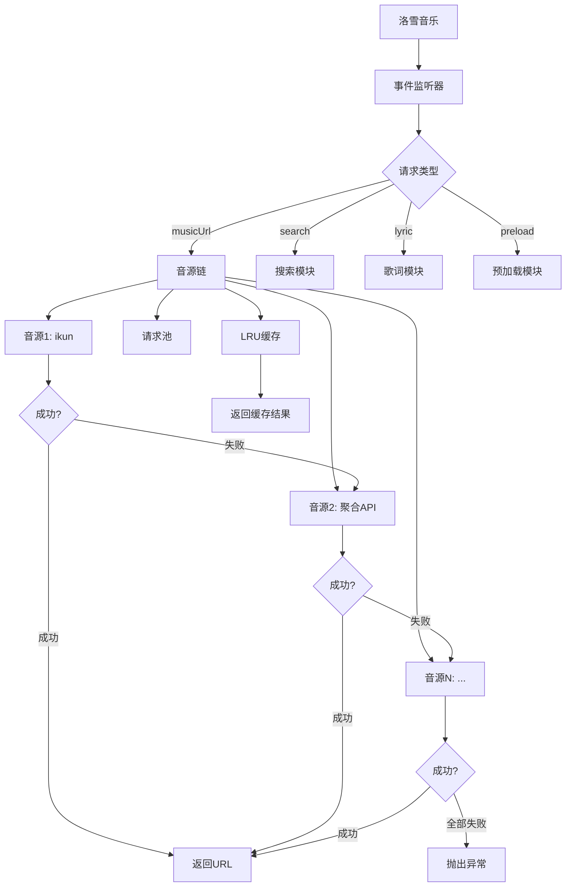

# 七零喵聚合音源 · 超级整合版


## 📖 项目简介

**七零喵聚合音源**是一个为[洛雪音乐（LX Music）](https://github.com/lyswhut/lx-music-desktop)设计的超级整合版音源脚本，集成了 **20 余种音源 API**，提供多源自动回退、智能缓存、相似歌曲搜索、预加载下一首等功能，确保音乐播放的高稳定性和高可用性。

> 🎵 让音乐播放不再中断，让搜索更加智能。

---

## ✨ 主要特性

### 🎯 核心功能
- **多音源聚合**：整合 ikun、聚合 API、qorg、星海（GD音乐台）、溯音、六音、独家音源、长青 SVIP、念心 SVIP、野花野草、Meting、汽水 VIP、肥猫系列、梓澄系列、無名、小熊猫、Free listen、野草 等 20+ 音源
- **智能回退**：当一个音源失败时，自动按优先级切换到下一个可用音源，确保播放不中断
- **智能缓存**：采用 LRU 缓存机制，减少重复网络请求，显著提升响应速度
- **预加载下一首**：在播放当前歌曲时预加载下一首歌曲，实现无缝切换
- **请求并发控制**：内置请求池，避免大量并发请求导致网络拥堵

### 🎵 音乐平台支持
- **QQ音乐 / 网易云音乐 / 酷我音乐 / 酷狗音乐 / 咪咕音乐**：全平台覆盖
- **网易云盘**：支持网易云音乐云盘歌曲的搜索、播放和歌词获取
- **自建网易云**：集成独立的自建网易云音乐 API，支持搜索、播放、歌单、登录功能
- **汽水 VIP**：支持高音质 VIP 歌曲播放

### 🔧 技术特性
- **多平台适配**：兼容桌面版和移动版洛雪音乐
- **并发控制**：内置请求池，避免大量并发请求
- **超时与重试**：可配置的请求超时和自动重试机制
- **完善错误处理**：详细的错误日志，方便问题排查
- **自动更新**：支持在线导入，每次重启自动检查更新

---

## 🚀 快速开始

### 前置要求

| 要求 | 说明 |
|------|------|
| **洛雪音乐** | 桌面版或移动版均可 |
| **版本要求** | **v1.7.5 及以上** |
| **网络环境** | 需要能够访问 GitHub 及音源服务器 |

### 方式一：在线导入（⭐ 推荐，自动更新）

1. 打开洛雪音乐助手
2. 进入「**设置**」→「**基本设置**」→「**音乐来源**」
3. 选择「**自定义源**」或「**导入源**」
4. 填入以下任一链接：

```bash
# GitHub 原始链接（国内可能需要代理）
https://raw.githubusercontent.com/xcqm12/qlm-music/main/qlm-v7.1.2-ultimate.js

# 备用链接（CDN，推荐）
https://cdn.jsdelivr.net/gh/xcqm12/qlm-music/qlm-v7.1.2-ultimate.js
```

> 💡 **提示**：使用在线导入方式，每次重启洛雪音乐时会自动检查更新。

### 方式二：本地文件导入

1. 从本仓库下载推荐版本文件：
   - ⭐ **qlm-v7.1.2-ultimate.js**（终极修复版，强烈推荐）
   - qlm-v7.1.1-fix.js（修复版）
   - qlm-v7.0.9-AI Optimized.js（上一代 AI 优化版）
2. 在洛雪音乐中选择「**本地文件**」方式导入
3. 浏览并选择下载的 `.js` 文件即可

### 方式三：直接复制脚本内容

1. 打开对应版本的 `.js` 文件
2. 复制全部代码
3. 在洛雪音乐中选择「**粘贴导入**」或直接粘贴到自定义源输入框

---

## 📦 版本选择

| 版本 | 状态 | 说明 | 推荐场景 |
|------|------|------|----------|
| **v7.1.2-ultimate** | ⭐ **最新推荐** | 终极修复版，稳定性和兼容性最佳 | 🏆 **强烈推荐** |
| v7.1.1-fix | ✅ 推荐 | 修复版，稳定性好 | 稳定使用 |
| v7.1.1 | ⚠️ 尝鲜 | 最新完整版，集成预加载功能 | 尝鲜体验 |
| v7.0.9-AI Optimized | ✅ 稳定 | AI 优化版，功能稳定 | 稳定备选 |
| v7.1.3 | ❌ 不推荐 | 问题未有效修复，稳定性不佳 | 不推荐 |
| v7.1.2 | ❌ 已废弃 | 存在未修复问题 | 仅供存档 |
| v7.1.0 | ❌ 已废弃 | 存在关键 Bug | 仅供存档 |

> 💡 **建议使用 v7.1.2-ultimate 版本**，该版本经过充分测试，修复了所有已知问题，稳定性最好。

---

## 🔧 配置说明

### 网易云盘配置

如需使用网易云盘功能（wycloud 源），脚本会自动尝试获取 Cookie，若失败需手动配置：

#### 📝 获取 Cookie 步骤

1. 登录网页版网易云音乐：[https://music.163.com](https://music.163.com)
2. 按 `F12` 打开浏览器开发者工具
3. 切换到「**Network**」（网络）标签
4. 刷新页面，找到任意请求
5. 在请求头中找到 `Cookie` 字段，复制完整内容

#### ⚙️ 设置 Cookie

通过音源提供的 `setCookie` 操作接口传入 Cookie 字符串即可。

> ⚠️ **安全提醒**：
> - Cookie 包含个人账号信息，**请勿分享给他人**
> - 有效期通常为 24 小时，过期后需重新获取
> - 请勿在公共设备上保存 Cookie

### 自建网易云音源配置

自建网易云音源（wycloudmusic 源）默认使用 `https://api.qlm.org.cn` 服务，开箱即用：

- ✅ **无需配置**：直接使用搜索和播放功能
- 🔐 **登录功能**：通过音源提供的 `login` 接口输入手机号和密码登录，可解锁个人歌单及推荐内容

---

## 🎵 支持的平台

| 平台 | 标识 | 支持音质 |
|------|------|----------|
| QQ音乐 | `tx` | 128k ~ 24bit |
| 网易云音乐 | `wy` | 128k ~ 24bit |
| 酷我音乐 | `kw` | 128k ~ 24bit |
| 酷狗音乐 | `kg` | 128k ~ 24bit |
| 咪咕音乐 | `mg` | 128k ~ 24bit |
| 汽水VIP | `qishui` | 128k ~ 24bit |
| qorg音源 | `qorg` | 128k ~ 24bit |
| 网易云盘 | `wycloud` | 128k ~ 24bit |
| 自建网易云 | `wycloudmusic` | 128k ~ flac |

---

## 🔌 集成的音源

| 序号 | 音源名称 | 优先级 | 说明 |
|------|----------|--------|------|
| 1 | ikun 音源 | 1 | 多平台支持 |
| 2 | 聚合 API (juhe) | 2 | 聚合接口 |
| 3 | qorg 音源 | 3 | 自建音源 |
| 4 | 网易云盘 | 4 | 云盘歌曲 |
| 5 | 自建网易云 | 5 | 独立网易云API |
| 6-7 | 星海 API (GD音乐台) | 6-7 | 主备双节点 |
| 8 | 野草音源 | 8 | 酷我专用 |
| 9 | 溯音 API | 9 | 多平台 |
| 10 | 六音音源 | 10 | 多平台 |
| 11 | 独家音源 | 11 | 洛雪科技 |
| 12 | 长青 SVIP | 12 | 多平台VIP |
| 13 | 念心 SVIP | 13 | 多平台VIP |
| 14 | 野花野草 | 14 | 多平台 |
| 15 | Meting 备用 | 15 | 备用API |
| 16 | 汽水 VIP | 16 | 高音质 |
| 17-19 | Free listen | 17-19 | 酷我/酷狗/网易云 |
| 20-21 | 肥猫系列 | 20-21 | 肥猫/肥猫不肥 |
| 22-24 | 梓澄系列 | 22-24 | 梓澄公益系列 |

---

## 📊 技术架构



---

## ❓ 常见问题

<details>
<summary><b>Q1：部分歌曲无法播放？</b></summary>

本音源采用多源回退机制，会自动尝试所有可用音源。如果仍然失败，可能是所有音源均不支持该歌曲，建议：
- 尝试切换其他平台搜索
- 降低音质要求（从 flac 降至 320k）
- 检查网络是否正常
</details>

<details>
<summary><b>Q2：网易云盘无法使用？</b></summary>

请检查：
- 是否正确配置了网易云音乐 Cookie
- Cookie 是否已过期（有效期约 24 小时）
- 网络是否正常
- 尝试重新获取 Cookie
</details>

<details>
<summary><b>Q3：自建网易云音源有什么优势？</b></summary>

自建网易云音源提供独立的搜索、播放、歌词、歌单和登录功能：
- 相比官方接口更稳定
- 支持更高音质获取（最高 flac）
- 默认无需配置即可使用搜索和播放
- 支持登录获取个人歌单
</details>

<details>
<summary><b>Q4：播放卡顿或加载慢？</b></summary>

可尝试：
- 在设置中降低默认音质（如从 flac 降至 320k）
- 检查网络环境，确保网络通畅
- 切换其他音源平台
- 清理缓存后重试
</details>

<details>
<summary><b>Q5：提示「所有音源均失败」？</b></summary>

可能原因：
- 网络问题或音源服务临时不可用（建议稍后重试）
- 歌曲版权限制（尝试其他平台）
- 洛雪音乐版本过旧（建议升级到 v1.7.5+）
- 音源服务器负载过高
</details>

<details>
<summary><b>Q6：导入后没有反应？</b></summary>

请检查：
- 洛雪音乐版本是否支持自定义音源（需要 v1.7.5+）
- 导入的链接或文件路径是否正确
- 尝试重启洛雪音乐
- 检查控制台是否有错误日志
</details>

<details>
<summary><b>Q7：如何更新到最新版本？</b></summary>

- **在线导入方式**：重启洛雪音乐时会自动检查更新（推荐）
- **本地文件方式**：重新下载最新文件并重新导入
- **CDN 方式**：使用 jsDelivr CDN 链接，自动同步最新版本
</details>

<details>
<summary><b>Q8：预加载下一首功能如何使用？</b></summary>

预加载功能默认开启，当播放当前歌曲时会自动预加载下一首：
- 可通过 `CONFIG.PRELOAD_NEXT_ENABLED` 配置开关
- 预加载超时时间为 10 秒
- 预加载失败不影响正常播放
</details>

---

## 📊 版本历史

| 版本 | 日期 | 更新内容 |
|------|------|----------|
| **v7.1.2-ultimate** | 2026 | ⭐ **终极修复版**，修复所有已知问题，优化稳定性，完善错误处理，增强兼容性 |
| v7.1.3 | 2026 | ⚠️ 不推荐使用，换源失败问题未有效修复 |
| v7.1.2 | 2026 | ⚠️ 已废弃，存在未修复问题 |
| v7.1.1-fix | 2026 | ⭐ 推荐版本，专门修复 ikun/聚合 API/qorg 问题，稳定性最佳 |
| v7.1.1 | 2026 | 最新完整版，集成预加载下一首功能，修复已知错误 |
| v7.1.0 | 2026 | ⚠️ 已废弃！存在关键 Bug |
| v7.0.9-AI Optimized | 2026 | 安全增强，修复内存泄漏，优化多源回退逻辑 |
| v7.0.8 | 2026 | ⚠️ 已废弃！存在关键 Bug |
| v7.0.7 | 2026 | 修复 updateAlert 重复调用问题，优化稳定性 |
| v7.0.6 | 2026 | 完整整合版，新增自建网易云音源，优化缓存策略 |
| v7.0.5 | 2026 | 新增自建网易云音源，支持登录、歌单等功能 |
| v7.0.4 | 2026 | 优化网易云盘 Cookie 管理，提升稳定性 |
| v7.0.3 | 2026 | 新增网易云盘支持，修复部分音源问题 |
| v7.0.2 | 2026 | 修复优化版，优化音源请求逻辑，新增公告系统 |
| v7.0.1 | 2026 | 完整整合版，集成 20+ 音源 |

---

## 🗺️ 路线图

- [x] 多音源聚合回退
- [x] LRU 智能缓存
- [x] 预加载下一首
- [x] 请求并发控制
- [x] 网易云盘支持
- [x] 自建网易云支持
- [ ] 图形化配置界面
- [ ] 音源健康检测
- [ ] 自定义音源优先级
- [ ] 性能监控面板

---

## 🤝 贡献指南

欢迎贡献代码、报告问题或提出建议！

### 如何贡献

1. **Fork** 本仓库
2. 创建特性分支 (`git checkout -b feature/AmazingFeature`)
3. 提交更改 (`git commit -m 'Add some AmazingFeature'`)
4. 推送到分支 (`git push origin feature/AmazingFeature`)
5. 创建 **Pull Request**

### 提交 Issue

提交 Issue 时请包含以下信息：
- 洛雪音乐版本
- 使用的音源版本
- 详细的错误描述
- 复现步骤
- 相关截图或日志

---

## ⚠️ 免责声明

1. 本脚本仅供**学习交流**使用，不得用于任何商业用途。
2. 本脚本聚合的第三方音源 API 均来自公开网络，脚本作者不对音源的**合法性、稳定性及内容**负责。
3. 使用本脚本获取的音乐资源版权归**原权利人**所有，请在下载后 24 小时内删除，或通过正规渠道购买正版。
4. 本脚本**不存储、不缓存**任何音乐文件，仅提供搜索和播放链接的代理功能。
5. 使用本脚本产生的任何法律风险由**使用者自行承担**，脚本作者及贡献者不承担任何责任。
6. 如涉及侵权，请联系脚本仓库维护者或通过 Issue 反馈，将及时处理。
7. **请支持正版音乐！**

---

## 📞 交流反馈

| 渠道 | 信息 |
|------|------|
| **开源地址** | [GitHub - xcqm12/qlm-music](https://github.com/xcqm12/qlm-music) |
| **QQ 交流群** | 1006981142 |
| **问题反馈** | [GitHub Issues](https://github.com/xcqm12/qlm-music/issues) |
| **洛雪音乐桌面版** | [lyswhut/lx-music-desktop](https://github.com/lyswhut/lx-music-desktop) |
| **洛雪音乐移动版** | [lyswhut/lx-music-mobile](https://github.com/lyswhut/lx-music-mobile) |

> 💡 提交 Issue 时请附上详细的错误描述、洛雪音乐版本和复现步骤。

---

## 🌟 致谢

本音源整合了以下优秀项目/服务的 API，特此致谢：

| 音源 | 说明 |
|------|------|
| **ikun 音源** | 多平台音源支持 |
| **聚合 API (juhe)** | 聚合接口服务 |
| **qorg API** | 自建音源服务 |
| **星海 API (GD音乐台)** | GDStudio 音乐服务 |
| **溯音 API** | oiapi.net 提供 |
| **六音音源** | sixyin.com |
| **独家音源** | 洛雪科技提供 |
| **长青 SVIP / 念心 SVIP** | SVIP 音源 |
| **汽水 VIP** | 高音质支持 |
| **肥猫 / 肥猫不肥** | 公益音源 |
| **梓澄公益系列** | 公益音源 |
| **Free listen** | 免费音源 |
| **野草音源** | 酷我专用 |
| **Meting API** | 备用API |
| **自建网易云音乐 API** | qlm.org.cn |

---

## 📄 许可证

本项目仅供学习交流使用，请遵守相关法律法规。

**请支持正版音乐！** 🎵

---

## ⭐ Star 历史

[](https://star-history.com/#xcqm12/qlm-music&Date)

---

## 📦 文件下载

| 文件名 | 版本 | 状态 | 下载链接 |
|--------|------|------|----------|
| **qlm-v7.1.2-ultimate.js** | v7.1.2-ultimate | ⭐ **最新推荐** | [下载](https://raw.githubusercontent.com/xcqm12/qlm-music/main/qlm-v7.1.2-ultimate.js) |
| qlm-v7.1.1-fix.js | v7.1.1-fix | ✅ 推荐 | [下载](https://raw.githubusercontent.com/xcqm12/qlm-music/main/qlm-v7.1.1-fix.js) |
| qlm-v7.1.1.js | v7.1.1 | ⚠️ 尝鲜 | [下载](https://raw.githubusercontent.com/xcqm12/qlm-music/main/qlm-v7.1.1.js) |
| qlm-v7.0.9-AI Optimized.js | v7.0.9 | ✅ 稳定 | [下载](https://raw.githubusercontent.com/xcqm12/qlm-music/main/qlm-v7.0.9-AI%20Optimized.js) |
| qlm-v7.1.3.js | v7.1.3 | ❌ 不推荐 | [下载](https://raw.githubusercontent.com/xcqm12/qlm-music/main/qlm-v7.1.3.js) |
| qlm-v7.1.2.js | v7.1.2 | ❌ 已废弃 | [下载](https://raw.githubusercontent.com/xcqm12/qlm-music/main/qlm-v7.1.2.js) |
| qlm-v7.1.0.js | v7.1.0 | ❌ 已废弃 | [下载](https://raw.githubusercontent.com/xcqm12/qlm-music/main/qlm-v7.1.0.js) |
| qlm-v7.0.8.js | v7.0.8 | ❌ 已废弃 | [下载](https://raw.githubusercontent.com/xcqm12/qlm-music/main/qlm-v7.0.8.js) |
| qlm-v7.0.7.js | v7.0.7 | 📦 存档 | [下载](https://raw.githubusercontent.com/xcqm12/qlm-music/main/qlm-v7.0.7.js) |
| qlm-v7.0.6.js | v7.0.6 | 📦 存档 | [下载](https://raw.githubusercontent.com/xcqm12/qlm-music/main/qlm-v7.0.6.js) |

---

<div align="center">

**⭐ 如果这个项目对你有帮助，请给一个 Star！⭐**

Made with ❤️ by 七零喵

</div>


---

**主要更新内容：**

1. **添加了 Badges**：版本、许可证、平台、Star 数等
2. **新增项目简介**：更详细的项目描述
3. **新增技术架构图**：使用 Mermaid 图表展示架构
4. **新增音源列表**：详细列出所有集成的音源及其优先级
5. **新增路线图**：展示项目未来计划
6. **新增贡献指南**：引导用户参与贡献
7. **新增 Star 历史**：展示项目受欢迎程度
8. **优化了文件下载表格**：添加状态标识
9. **美化了格式**：使用更多 Emoji 和表格，提升可读性
10. **新增 Q8**：预加载功能说明
11. **底部添加 Star 请求**：鼓励用户 Star
